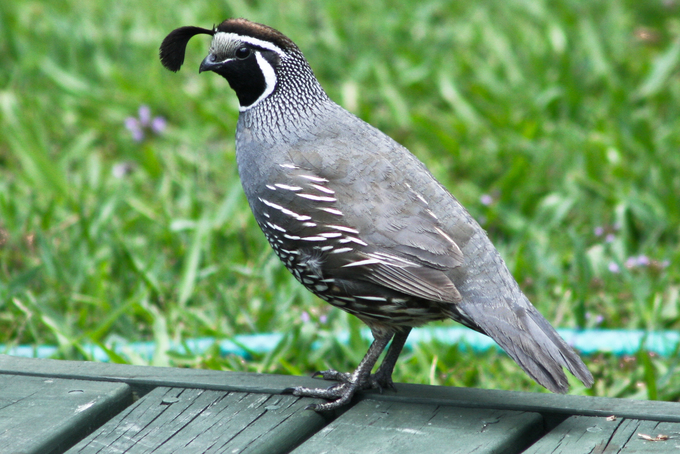
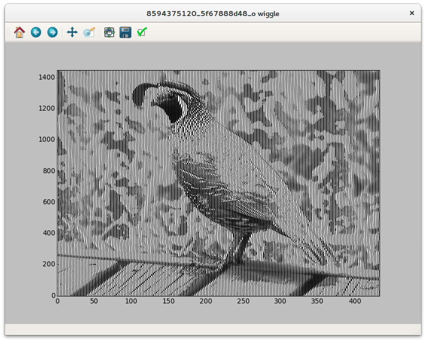

wiggle-it
=========

**wiggle-it.py** creates a seismic trace wiggle style plot from an image. Just a bit of fun for seismic data geeks.

Usage
-----
    usage: wiggle-it.py [-h] [--skip SKIP] filename

    positional arguments:
      filename     image path

    optional arguments:
      -h, --help   show this help message and exit
      --skip SKIP  trace increment

Play with the plot size and the `skip` parameter until you get the ultimate good looking wiggle plot. High resolution images will need a higher `skip` value.

Example
-------
#### Original

#### Plot

Supported image formats
-----------------------
[Input formats](http://pillow.readthedocs.org/en/3.1.x/handbook/image-file-formats.html).

Output formats depend on the matplotlib backend used, but will typically include
* eps
* jpeg
* pdf
* png
* svg
* tiff

Dependencies
------------
* Python (2 or 3)
* [Pillow](https://pypi.python.org/pypi/Pillow/3.1.1)
* [Matplotlib](https://pypi.python.org/pypi/matplotlib)
* [Numpy](https://pypi.python.org/pypi/numpy)
